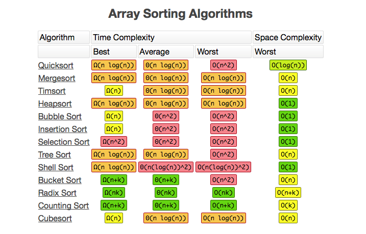
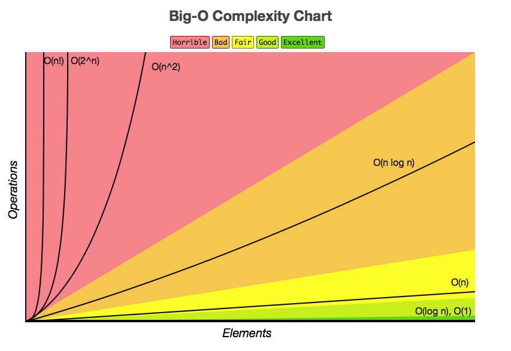

# Algorithms for sorting data

## Temas

**Buenos** algoritmos de ordenamiento:

- Merge sort 
- Tim sort
- Heap sort  

Muy buenos:

- Radix sort
- Couning sort

Algoritmo aleatorio:

- Randomized Quicksort

**No tan buenos** algoritmos de ordenamiento, pues O(n^2):

- Quicksort  
- Insertion Sort
- Selection Sort
- Bucket sort
- Shell sort

La columna importante es la de **Time Complexity, Worst**:

## Referencias
[bigocheatsheet](http://bigocheatsheet.com)
